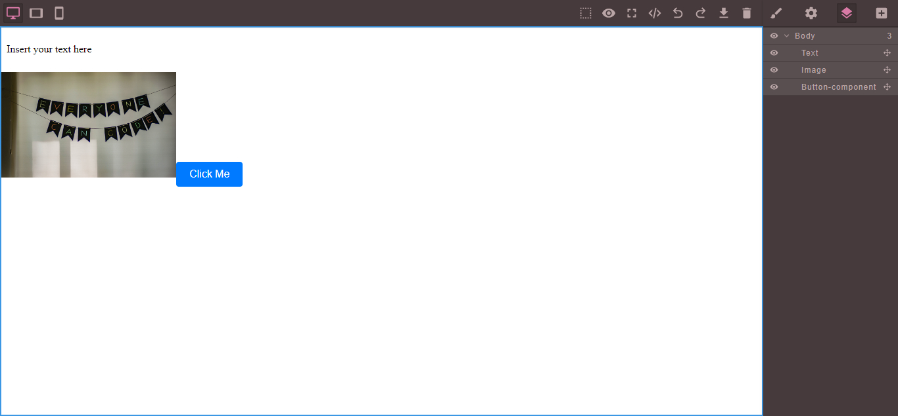

# WYSIWYG Web Page Builder

## Setup

1. Clone the repository.
2. Navigate to the project directory.
3. Install dependencies: `npm install`
4. Start the project: `npm start`

## Usage

- Drag and drop components from the toolbar to the canvas.
- Edit text directly on the canvas with double click.
- Use the preview icon on toolbar to switch between edit mode and preview mode.

## Image of working app

